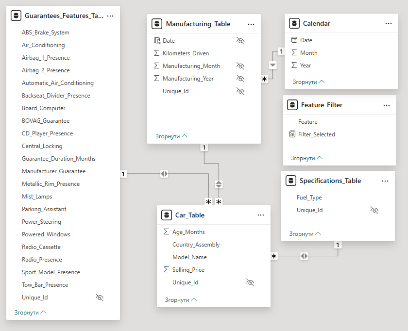
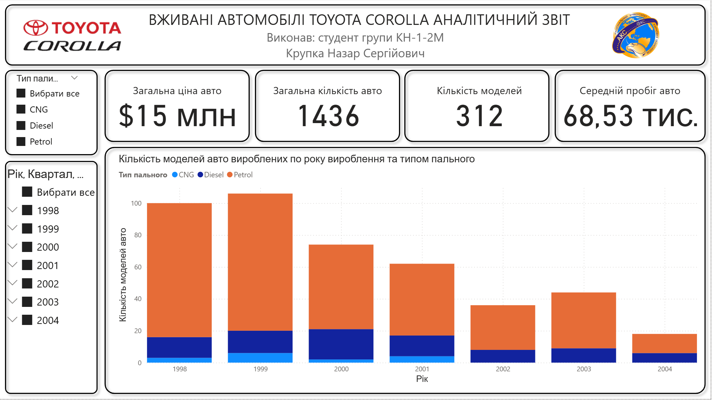
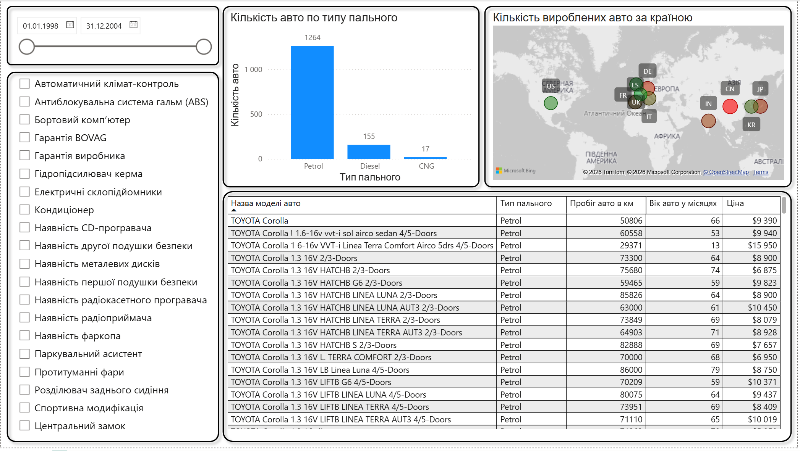
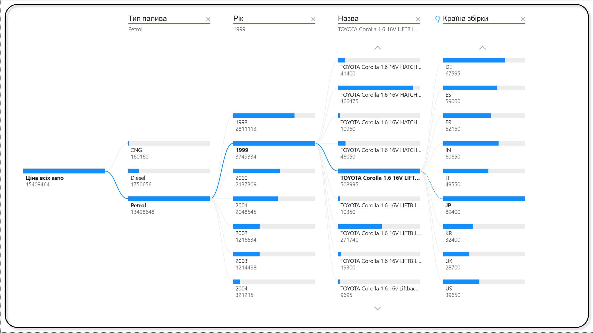

# Аналіз даних вживаних автомобілів Toyota Corolla

Інтерактивний аналітичний дашборд, розроблений у Power BI для аналізу ринку вживаних автомобілів Toyota Corolla.

## Про проект

Курсова робота з дисципліни «Аналітика великих даних».  
Спеціальність: 122 «Комп’ютерні науки»  
Національний університет харчових технологій (НУХТ), Київ, 2024

**Тема роботи:** Збір відкритої інформації та побудова аналітичного звіту за темою «Аналіз даних вживаних автомобілів Toyota Corolla».

## Мета проекту

Створення інтерактивного аналітичного звіту для дослідження цінових тенденцій, технічних характеристик, географічного розподілу та залежностей між параметрами вживаних автомобілів Toyota Corolla.

## Використані технології

- Microsoft Power BI Desktop
- Power Query (очищення та трансформація даних)
- DAX (розрахункові міри та показники)
- Зіркоподібна модель даних

## Модель даних

Модель даних включає наступні таблиці:
- Car_Table
- Manufacturing_Table
- Guarantees_Features_Table
- Specifications_Table
- Calendar
- Feature_Filter

## Структура дашборду

Дашборд складається з трьох основних сторінок:

1. **Загальні відомості** — ключові показники (загальна кількість автомобілів, середній пробіг, загальна ціна, кількість моделей), розподіл за роками виробництва та типом пального.
2. **Деталі** — детальна таблиця автомобілів, розподіл за типом пального, географічна карта країн складання, фільтри за технічними характеристиками (чекбокси).
3. **Дерево декомпозицій** — ієрархічний drill-down аналіз за типом пального, роком випуску, моделлю та країною складання.

## Візуалізація дашборду

**Головна сторінка (Загальні відомості)**

**Сторінка «Деталі»**

**Сторінка «Дерево декомпозицій»**

## Структура репозиторію

- `reports/` — файл аналітичного звіту Power BI (`Toyota_Corolla_Analysis.pbix`)
- `data/` — очищені набори даних у форматі CSV
- `screenshots/` — знімки екрану сторінок дашборду та моделі даних
- `KP_KH_1_2M_Krupka_NS.docx` — текст курсової роботи

## Джерело даних

Датасет: Toyota Corolla Car Price Prediction  
Kaggle: https://www.kaggle.com/datasets/victorahaji/toyota-corolla-car-price-prediction

## Автор

**Крупка Назар Сергійович**  
Студент магістратури  
Спеціальність 122 «Комп’ютерні науки»  
Національний університет харчових технологій (НУХТ)

---

Розроблено в рамках вивчення методів аналізу великих даних та візуалізації в Power BI.
